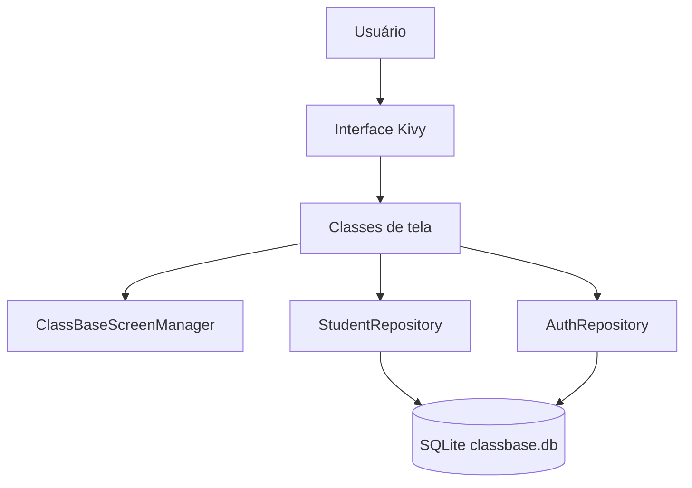
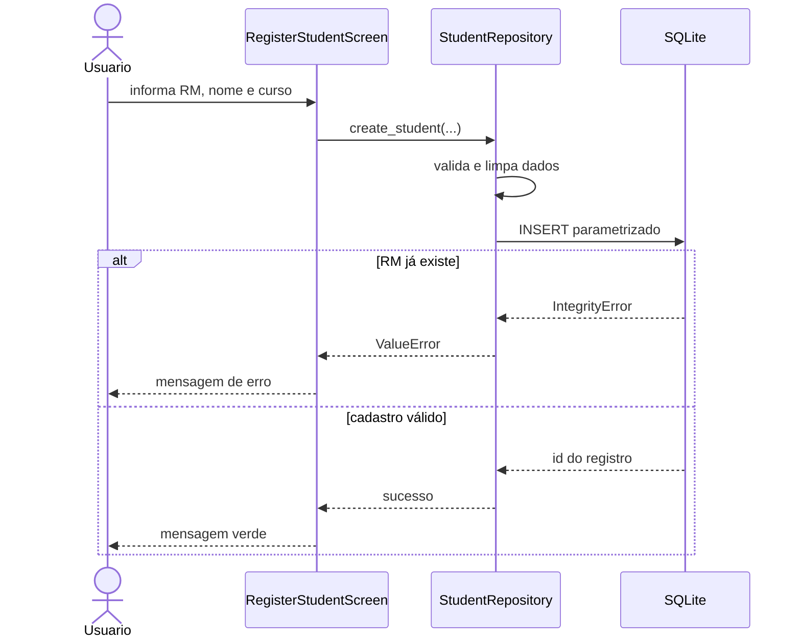
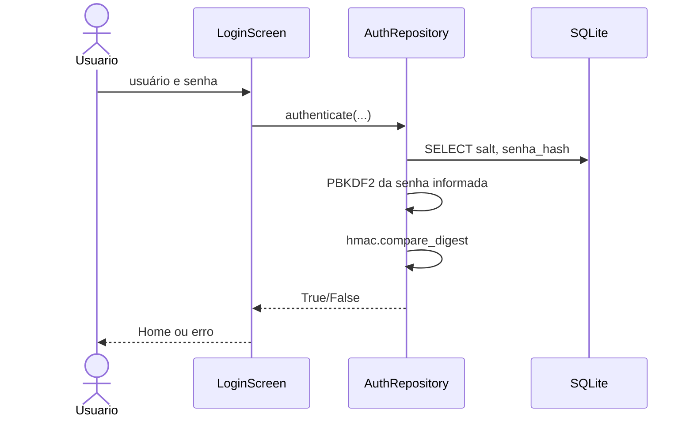

# Arquitetura do ClassBase

## Visão geral



## Estrutura do projeto

```text
ClassBase/
├── main.py
├── buildozer.spec
├── requirements.txt
├── assets/
│   ├── icon.png
│   └── presplash.png
├── database/
│   ├── connection.py
│   ├── auth.py
│   └── repository.py
├── screens/
│   ├── manager.py
│   ├── login.py
│   ├── home.py
│   ├── cadastro.py
│   ├── alunos.py
│   └── editar.py
├── kv/
│   ├── theme.kv
│   ├── login.kv
│   ├── home.kv
│   ├── cadastro.kv
│   ├── alunos.kv
│   └── editar.kv
├── tests/
└── docs/
```

## Responsabilidades

### main.py

- inicia o aplicativo;
- carrega os arquivos KV;
- define o banco no diretório gravável da aplicação;
- cria os repositórios;
- garante o usuário inicial;
- registra as cinco telas;
- configura o comportamento do teclado virtual.

### database/connection.py

- abre e fecha conexões SQLite;
- habilita foreign keys;
- executa commit em sucesso;
- executa rollback em exceção;
- cria as tabelas quando necessário.

### database/repository.py

Responsável pelos alunos:

- `create_student`;
- `get_student`;
- `list_students`;
- `update_student`;
- `delete_student`;
- `count_students`.

As consultas usam placeholders `?`, evitando concatenação direta de entrada do usuário no SQL.

### database/auth.py

Responsável por usuários e autenticação:

- criação de usuário;
- geração de salt;
- PBKDF2-HMAC-SHA256;
- autenticação;
- criação do usuário inicial.

### screens/

Cada classe representa o comportamento de uma tela. O layout visual correspondente fica em `kv/`.

Essa separação facilita explicar o projeto:

```text
arquivo .kv = aparência
arquivo .py da tela = comportamento
repository = acesso ao banco
```

## Fluxo de cadastro



## Fluxo de login



## Decisões importantes

- O RM é `TEXT UNIQUE NOT NULL`.
- O banco fica no `user_data_dir` do aplicativo no Android.
- A UI não conhece detalhes de SQL.
- O ScreenManager compartilha os repositórios com as telas.
- Cadastro e edição utilizam ScrollView para compatibilidade com teclado.
- O app funciona offline por decisão de escopo.
